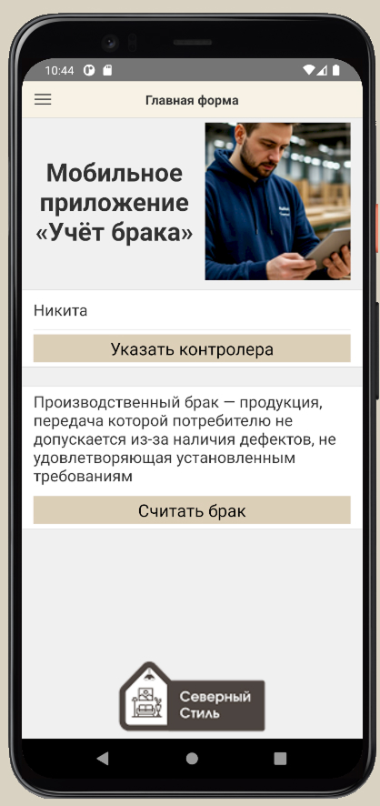
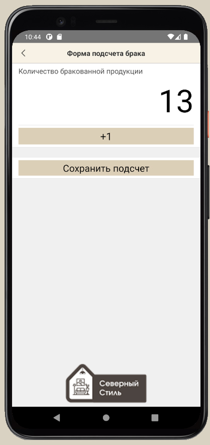
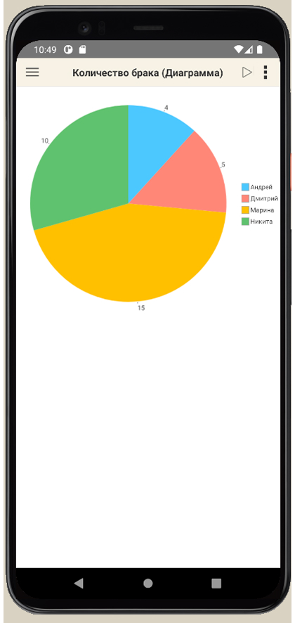
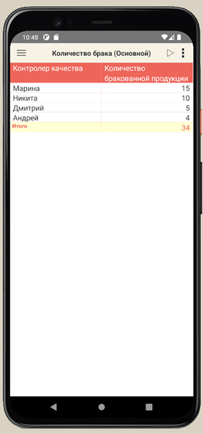
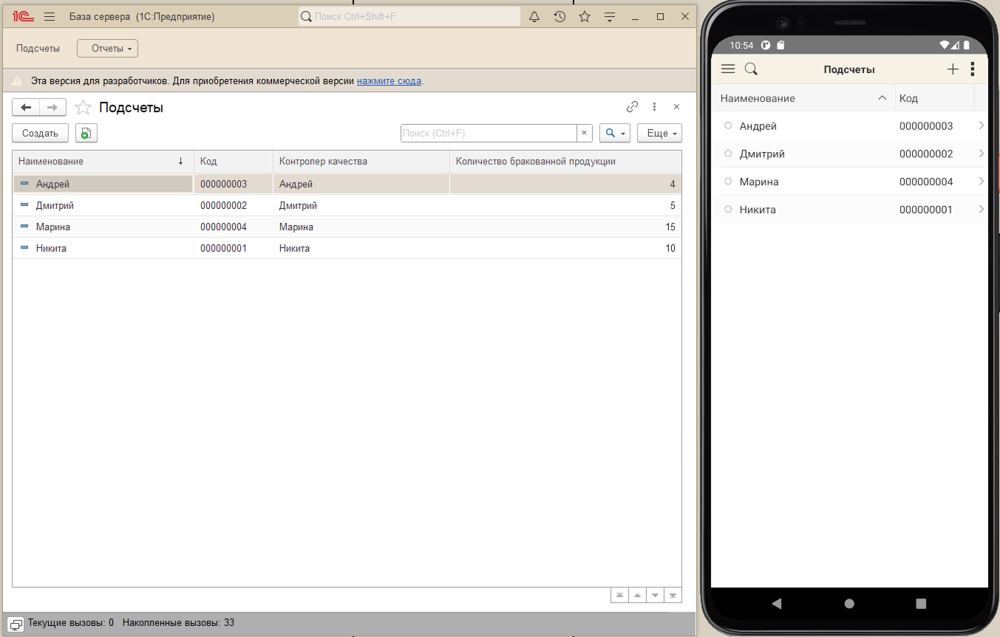
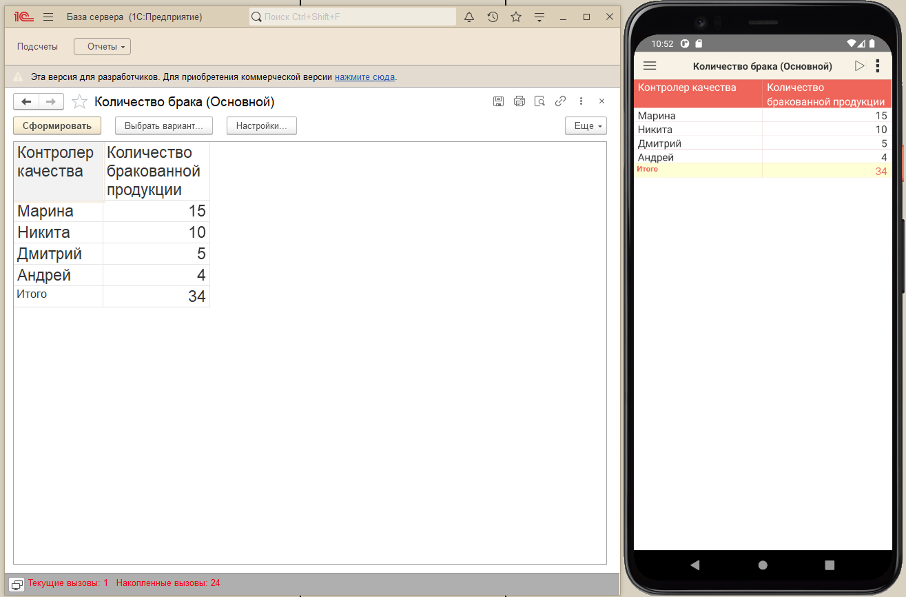
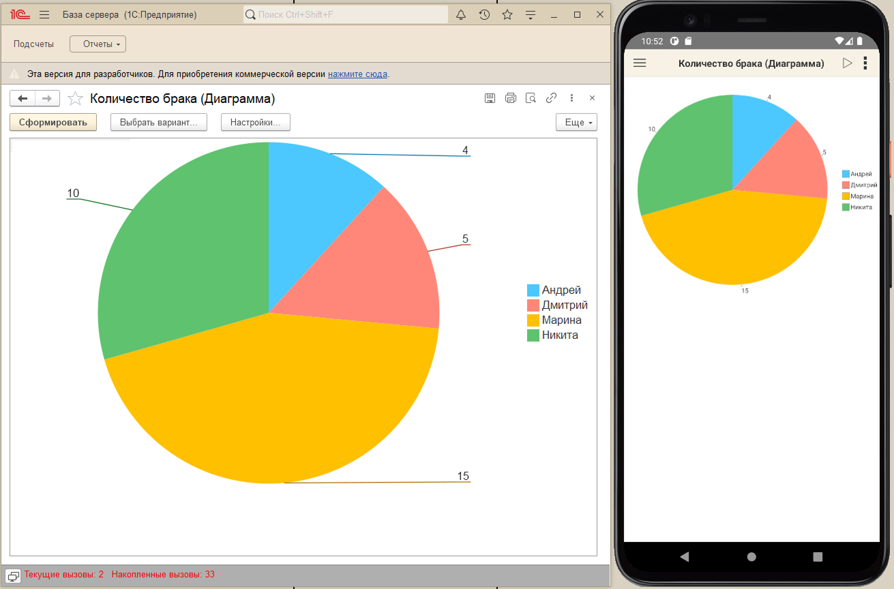

### О репозитории
Мобильное приложение: "Учёт брака"

Контролёр качества фиксирует количество бракованных единиц продукции. На основе данных формируются отчёты с возможностью сравнения показателей между проверяющими.

В приложении реализован обмен данными между мобильным приложением «Учет брака» и информационной базой «База сервера»

Мобильное приложение:

  
  
  
  

База сервера и мобильное приложение:

  
  
  

### Структура репозитория
- Мобильное приложение
- База сервера

### Источники информации
- Айгуль Султанова, Алёна Шаронова «1С:Счетчик ворон. Мастер-класс по мобильной разработке в среде 1С:Предприятие». - ООО «1С-Паблишинг», 2023
